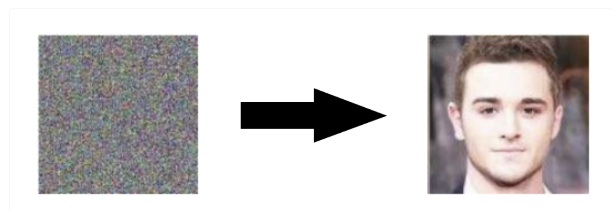

**AI Diffusion Models** Are generative models, which means they are used to generate data similar to what they were trained on. The models work by destroying training data through the addition of Gaussian noise, and then learning to recover that data.

### About Diffusion Models
- A Diffusion model is a deep learning generative model that works by adding noise to the available training data known as the forward diffusion process, it then reverses the process to recover the data. This is known as denoising or the reverse diffusion process.

- The three fundamental mathematical frameworks that support the science behind diffusion models, work on the same principles of adding noise and removing it to generate new samples. 

- **DDPMs** : Denoising Diffusion Probabilistic Models (generative models mainly used to remove noise from visual or audio data).

- **SGMs** : Noise-Conditioned Score-Based Generative Models (can generate new samples from a given distribution. They work by learning an estimation score function that can estimate the log density of the target distribution). 
*In english this means buiding of an estimate based on observed data of which we would like to sample*.

- **SDEs** : Stochastic Differential Equations (describe changes in random processes concerning time. Widely used in physics and financial markets involving random factors that significantly impact market outcomes).
## Image Generation

- Diffusion models start with a base image from what it has been previously trained on and slowly adds more and more gaussian noise over time.   
- It then gradually removes the noise, this learned denoising process then generates new, high-quality images from random seeds also known as random noised images.
