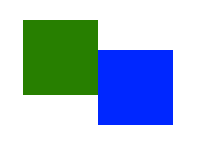

Specifies the distance of an element from the top of its current location if the element has `position: relative` declared or from the top of its nearest ancestor when the ancestor has `position: relative` and the element has `position: absolute` declared.

## Syntax

```css
top: <value>;
```

where `<value>` can be one of the following:

- Length value: `20px`
- Percentage value: `5%`
- Keyword value: `auto`, `inherit`

**Note:** If none of the ancestors have `position: relative` declared, the absolute positioned element will traverse the DOM until it reaches the `body` tag, at which point it will position itself at the top of the page regardless of its location in the source HTML.

## Example 1

Set the position of `.box` element `40px` from the top of the nearest relative position ancestor or from the document if none exist.

```css
.box {
  height: 100px;
  width: 100px;
  background-color: blue;
  position: absolute;
  top: 40px;
}
```



The blue box is positioned `40px` down from the top of the nearest ancestor with `position: relative` declared, which is the green box.

## Example 2

Set the position of `.box` element `100px` from the elements top edge.

```css
.box {
  height: 100px;
  width: 100px;
  background-color: blue;
  position: relative;
  top: 100px;
}
```


The blue box is positioned `100px` down from its original position, represented by the red line.
