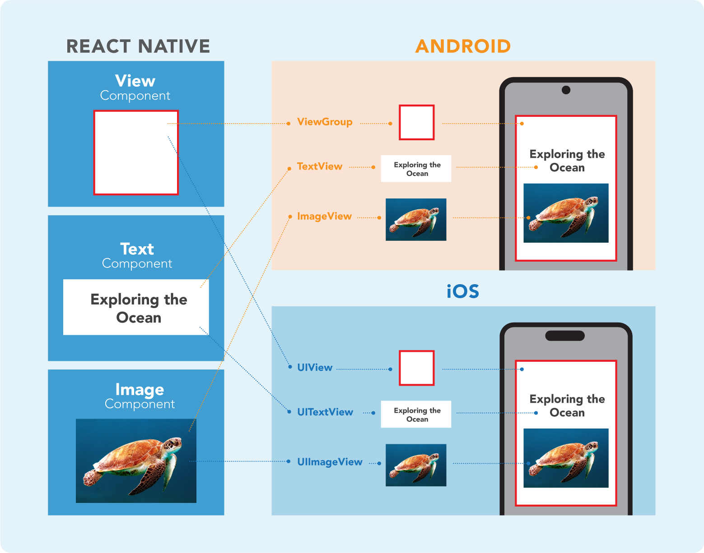
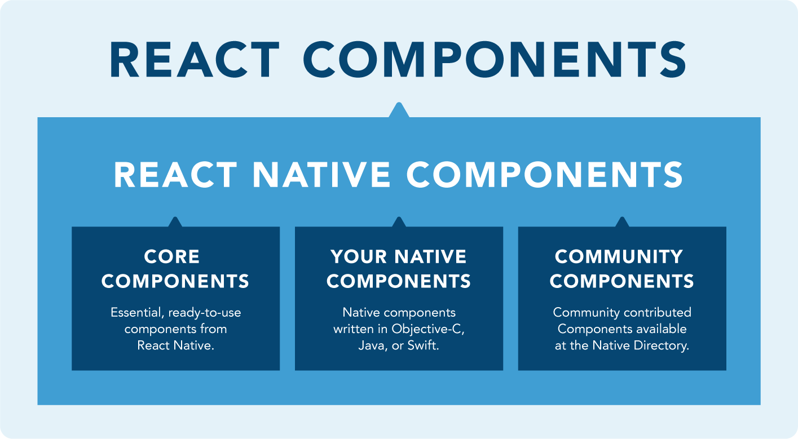

**React Native Components** are bundles of reusable, nestable code used to describe the appearance and behavior of a User Interface (UI).

## UI Views

The basic building block of a **UI** is the **View,** a small, rectangular and often times nestable element that can be used to display text, images and respond to user input. React Native works by invoking these Views in their native environment with JavaScript, using React Components.



## Native Components

These previously mentioned platform-backed components are called **Native Components,** and React Native creates the corresponding, platform specific Views (whether iOS or Android) for these components at runtime. Because of this, React Native apps look, feel and perform like Native apps.

## Core Components

React Native offers a set of essential, ready-to-use Native Components called **Core Components.** There are many components ranging from Text to Activity Indicators. Most apps will use these Core Components:

| React Native Component | Description | 
| --- | --- |
| \<View> | Is a container analog to a \<div> in html. It supports layout with flexbox, styles, touch handling, accessibility controls and can contain other components inside, including other views. | 
| \<Text> | Displays text, support styles and touch events. It can also nest other Text components. | 
| \<Image> | Displays different types of images, including from network, static, local disks and from ‘data:’ uri scheme. | 
| \<TextInput> | Allows the input of text by the user and provides several configuration capabilities such as auto-correction, auto-capitalization, placeholder text, etc. |
|\<ScrollView> | An scrolling container that can nest multiple components and views. It can scroll vertically or horizontally. |

## Community Components

React Native Componens can also be custom-built, and there’s a big ecosystem of these Community-built Components that can be accessed on the [**Native Directory**](https://reactnative.directory/)

## React Native Components are based on React



React Native Components share the same API structure as **React Components.** Whatever a component returns is rendered as a React element, which allows to describe what’s seen on the screen. They can also be defined as ***Function Component*** or ***Class Components:***

 - #### Function Component:
	```jsx
    import React from 'react';
    import { Text } from 'react-native';
    
    const Box = () => {
        return (
            <Text>I have a small box</Text>
        );
    }
    
    export default Box;
    ```
    Try this code example [HERE.](https://snack.expo.dev/@ericsonrd/rn-function-component)
    
 - #### Class Component:
	```jsx
    import React, { Component } from "react";
    import { Text } from 'react-native';
    
    class Box extends Component {
        render() {
            return (
                <Text>I have a small box</Text>
            );
        }
    }
    
    export default Box;
    ```
    Try this code example [HERE.](https://snack.expo.dev/@ericsonrd/rn-class-component)
	

## JSX, Props and State.

React Native Components also use **JSX,** accept **Props** and manage **State.**

 - ### JSX
	As in React, the JSX syntax in React Native allows writing elements inside JavaScript, and also the use of variables inside them:

	```jsx
    import React from 'react';
    import { Text } from 'react-native';

    const Box = () => {
        const size = “small”;
        return (
            <Text>I have a {size} box</Text>
        );
    }

    export default Box;
    ```
    Try this code example [HERE.](https://snack.expo.dev/@ericsonrd/rn-component-jsx)
	
 - ### Props
	 Most React Native Core Components accept Props, for example, you can pass different sizes via Props to this Box component:
	```jsx
    import React from 'react';
    import { View, Text } from 'react-native';

    const Box = (props) => {
        return (
            <Text>I have a {props.size} box</Text>
        );
    }
	
    const BoxCollection = () => {
        return (
            <View>
                <Box size=“small” />
                <Box size=“medium” />
                <Box size=“large” />
            </View>
        );
    }

    export default BoxCollection;
    ```
    Try this code example [HERE.](https://snack.expo.dev/@ericsonrd/rn-component-props)
	
 - ### State
	 Just like React, React Native Components use State to handle data that changes over time, such as with user interaction:
	```js
    import React, { useState } from "react";
    import { View, Text, Button } from "react-native";

    const Box = () => {
        const [size, setSize] = useState("small");
        return (
            <View>
                <Text>I have a {size} box </Text>
                <Button
                    color="red"
                    onPress={() => setSize("small")}
                    title="Small" />
                <Button
                    color="blue"
                    onPress={() => setSize("medium")}
                    title="Medium" />
                <Button
                    color="orange"
                    onPress={() => setSize("large")}
                    title="Large" />
            </View>
        );
    }

    export default Box;
    ```
    Try this code example [HERE.](https://snack.expo.dev/@ericsonrd/rn-component-state)
