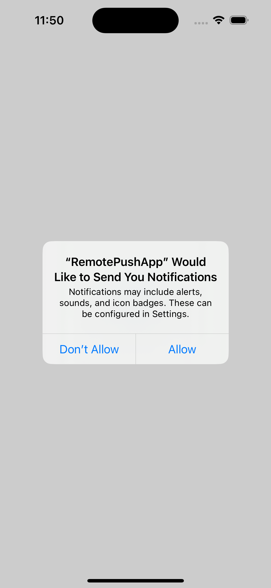

**Notifications** in SwiftUI are presented with two options types to keep users informed and engaged: Local notifications and Remote(push) notifications. Local notifications differ from remote (push) notifications in that they don't depend on a server to deliver messages to users' devices. While remote (push) notifications use Apple's Push Notification Service (APNS) for message delivery, local notifications are self-contained within the app. 
UserNotifications framework helps to schedule and manage notifications in both cases whether they are local or remote (push) notifications.

## Local Notifications

Definition: Local notifications are created and scheduled within the app itself, without any need for an external server. They are ideal for reminders, calendar events, or any other notifications that are triggered by the app based on user actions or predefined schedules.

Scheduling: The developer sets up the timing and content of these notifications. They can be scheduled to appear at a specific time or in response to a particular event within the app.

User permissions: Though less intrusive than remote notifications, local notifications still require user permission. The app must request and obtain permission to send notifications to the user.

Customization: Local notifications can be customized with various options such as sound, alerts, or badges. They can also be configured to trigger certain actions when interacted with.

Implementation in SwiftUI: Implementing local notifications in SwiftUI involves using the UNUserNotificationCenter to manage notification content, request permission, and schedule the notification delivery.

Code example below creates a basic notification with a time-based trigger:

```swift
import UserNotifications

func scheduleTimeBasedNotification() {
    // 1. Request permission to display alerts and play sounds.
    UNUserNotificationCenter.current().requestAuthorization(options: [.alert, .sound]) { granted, error in
        if granted {
            print("Permission granted")
        } else if let error = error {
            print(error.localizedDescription)
        }
    }

    // 2. Create the content for the notification
    let content = UNMutableNotificationContent()
    content.title = "Reminder"
    content.body = "Don't forget to check the app!"
    content.sound = UNNotificationSound.default

    // 3. Set up a trigger for the notification
    // For example, 10 seconds from now
    let trigger = UNTimeIntervalNotificationTrigger(timeInterval: (10), repeats: false)

    // 4. Create the request
    let request = UNNotificationRequest(identifier: UUID().uuidString, content: content, trigger: trigger)

    // 5. Add the request to the notification center
    UNUserNotificationCenter.current().add(request) { error in
        if let error = error {
            print(error.localizedDescription)
        } else {
            print("Notification scheduled")
        }
    }
}

```

## Remote (Push) Notifications

Definition: Remote notifications, also known as push notifications, are sent from a server directly to the user's device. Push notifications are effective because they can be received even when the app is not in use, and they offer the ability to be extensively personalized and tailored for each individual user. They are commonly used for real-time updates like news alerts, social media updates, or other timely information.

Server interaction and APNS: Remote notifications require a backend server that sends the notification payload to Apple’s Push Notification Service (APNS), which then delivers the message to the appropriate device.

User permissions and settings: As with local notifications, user permission is required. The app must explicitly ask the user to allow push notifications. Users can also customize their settings for these notifications.

Content and interaction: Remote notifications can include media like images and sounds and can provide options for user interactions, such as replying to a message directly from the notification.

Implementation in SwiftUI: Implementing push notifications in a SwiftUI app involves configuring the app to receive remote notifications, handling the registration process with APNS, and then dealing with the incoming notification data appropriately.


Here is the code example handling Remote (push) notifications in SwiftUI:

### Request notification permission

In a new SwiftUI project, an `AppDelegate` is not included by default. So it is essential to obtain the device token for push notifications. Therefore, the first step is to add an `AppDelegate` class to the project, enabling us to receive the device token when requesting remote push notifications.

```swift
import Foundation
import UIKit
import UserNotifications

class AppDelegate: NSObject, UIApplicationDelegate {

    func application(_ application: UIApplication, didFinishLaunchingWithOptions launchOptions: [UIApplication.LaunchOptionsKey: Any]?) -> Bool {
        UNUserNotificationCenter.current().requestAuthorization(options: [.alert, .badge, .sound]) { granted, error in
            if granted {
                DispatchQueue.main.async {
                    UIApplication.shared.registerForRemoteNotifications()
                }
            }
        }
        return true
    }

    func application(_ application: UIApplication, didRegisterForRemoteNotificationsWithDeviceToken deviceToken: Data) {
        // Convert token to string and send to your server
        let tokenString = deviceToken.map { String(format: "%02.2hhx", $0) }.joined()
        print("Device push notification token: \(tokenString)")
        // Here you would typically send the token to your server
    }

    func application(_ application: UIApplication, didFailToRegisterForRemoteNotificationsWithError error: Error) {
        print("Failed to register for remote notifications: \(error)")
    }
}

```

Second step is to link AppDelegate with SwiftUI app. To integrate the app delegate into the SwiftUI app lifecycle, the `UIApplicationDelegateAdaptor` property wrapper is used. Incorporate your delegate into your app's structure as shown in the following code to ensure that the application's launch code is executed. 

```swift
import SwiftUI

@main
struct RemotePushAppApp: App {
    
    @UIApplicationDelegateAdaptor private var appDelegate: AppDelegate
    
    var body: some Scene {
        WindowGroup {
            ContentView()
        }
    }
}
```



Push notifications offer a variety of functionalities. For instance, you can implement a Push Notification extension to manage elements like images, videos, or sounds, enhancing the interactivity of your notifications. Additionally, it's possible to activate push notifications in response to the user's location. Remote notifications serve as a powerful tool for marketing and communication, capable of boosting app engagement and driving revenue.